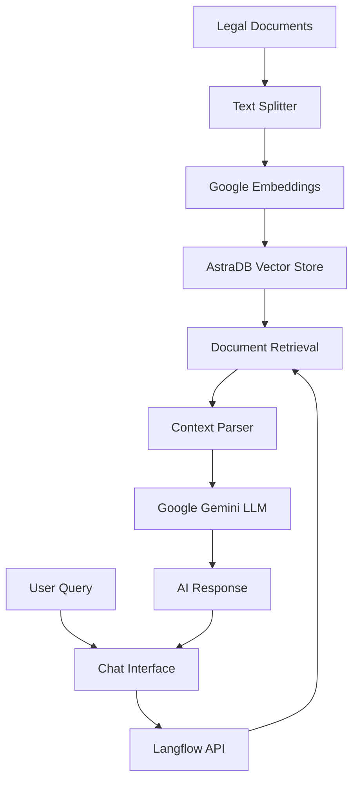

# Legal AI Assistant ⚖️

A powerful Legal Research Assistant powered by Retrieval Augmented Generation (RAG) technology, built with Langflow and featuring an intelligent chat interface for legal document analysis.

## 🌟 Features

- **🔍 Intelligent Document Search**: Semantic search through legal documents using vector embeddings
- **🤖 AI-Powered Analysis**: Context-aware responses using Google Gemini 1.5 Flash
- **📚 RAG Technology**: Retrieval Augmented Generation for accurate, source-based answers
- **⚡ Real-time Chat Interface**: Modern, responsive web interface
- **🏛️ Legal Expertise**: Specialized for Indian legal documents and procedures
- **📖 Citation Support**: Source attribution and legal references
- **💾 Vector Database**: Efficient document storage with AstraDB

## 🏗️ Architecture

### System Components



### Technology Stack

- **Frontend**: HTML5, CSS3, Vanilla JavaScript
- **Backend**: Langflow (Python-based)
- **Vector Database**: DataStax AstraDB
- **Embeddings**: Google Generative AI (text-embedding-004)
- **LLM**: Google Gemini 1.5 Flash
- **Document Processing**: LangChain text splitters

## 📋 Prerequisites

Before you begin, ensure you have:

- Python 3.8+ installed
- Node.js (optional, for local development server)
- Git for version control
- A Google AI API key
- DataStax AstraDB account and database

## 🚀 Local Deployment

### Step 1: Clone the Repository

```bash
git clone https://github.com/yourusername/legal-ai-assistant.git
cd legal-ai-assistant
```

### Step 2: Set Up Langflow Environment

```bash
# Create virtual environment
python -m venv venv

# Activate virtual environment
# On Windows:
venv\Scripts\activate
# On macOS/Linux:
source venv/bin/activate

# Install Langflow
pip install langflow
```

### Step 3: Configure API Keys

Create a `.env` file in the project root:

```env
# Google AI API Key
GOOGLE_API_KEY=your_google_api_key_here

# AstraDB Configuration
ASTRA_DB_APPLICATION_TOKEN=your_astra_token_here
ASTRA_DB_API_ENDPOINT=your_astra_endpoint_here
ASTRA_DB_KEYSPACE=default_keyspace
```

### Step 4: Set Up AstraDB


### Step 5: Import Langflow Configuration

```bash
# Start Langflow
langflow run --host 0.0.0.0 --port 7860

# Navigate to http://localhost:7860 in browser
# Import the flow.json file provided in the repository
```

### Step 6: Configure the Flow

1. **Open Langflow Interface**: Go to `http://localhost:7860`

2. **Import Flow**: 
   - Click "Import" 
   - Upload `flow.json` from the repository

3. **Update API Keys**:
   - Click on Google Generative AI Embeddings components
   - Enter your Google API key
   - Click on Google Generative AI Model component
   - Enter your Google API key

4. **Update AstraDB Settings**:
   - Click on AstraDB components
   - Enter your Astra DB Application Token
   - Verify database and collection names

### Step 7: Load Legal Documents


### Step 8: Start the Chat Interface

```bash
# Option 1: Simple HTTP Server
python -m http.server 8000

# Option 2: Using Node.js (if installed)
npx http-server -p 8000

# Open browser and navigate to:
# http://localhost:8000
```


## 🔧 Configuration

### Langflow Flow Configuration

The system uses a two-part flow architecture:

#### 1. Data Ingestion Flow (📚 Load Data)
- **File Component**: Loads legal documents
- **Text Splitter**: Chunks documents (2000 chars, 400 overlap)
- **Google Embeddings**: Converts text to vectors
- **AstraDB**: Stores embeddings

#### 2. Retrieval Flow (🐕 Retriever)
- **Chat Input**: User queries
- **AstraDB Search**: Vector similarity search
- **Parser**: Formats retrieved context
- **Prompt Template**: Structures AI prompt
- **Google Gemini**: Generates responses
- **Chat Output**: Returns formatted answer

### Environment Variables

| Variable | Description | Required |
|----------|-------------|----------|
| `GOOGLE_API_KEY` | Google AI API key for embeddings and LLM | Yes |
| `ASTRA_DB_APPLICATION_TOKEN` | AstraDB authentication token | Yes |
| `ASTRA_DB_API_ENDPOINT` | AstraDB database endpoint | Yes |
| `ASTRA_DB_KEYSPACE` | Database keyspace (default: default_keyspace) | No |


## 🤝 Contributing

1. Fork the repository
2. Create a feature branch (`git checkout -b feature/new-feature`)
3. Commit your changes (`git commit -am 'Add new feature'`)
4. Push to the branch (`git push origin feature/new-feature`)
5. Create a Pull Request

### Development Guidelines

- Follow PEP 8 for Python code
- Use meaningful commit messages
- Add tests for new features
- Update documentation as needed

## 📄 License

This project is licensed under the MIT License - see the [LICENSE](LICENSE) file for details.

## 🙏 Acknowledgments

- [Langflow](https://github.com/logspace-ai/langflow) for the visual flow builder
- [DataStax AstraDB](https://astra.datastax.com/) for vector database
- [Google AI](https://ai.google.dev/) for embeddings and language models
- [LangChain](https://langchain.com/) for document processing utilities

## 📞 Support

For support and questions:

- Create an [Issue](https://github.com/yourusername/legal-ai-assistant/issues)
- Email: mitesh.ai22@gmail.com

---

**⚖️ Disclaimer**: This Legal AI Assistant is for research and educational purposes. Always consult qualified legal professionals for official legal advice.
